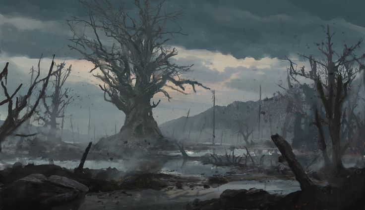

- The fallen wizard's tower
- Ancient Elven ruin in the mountains, with still rotating floating structures
- Old Armisian crypts
- The Ancient Ruins of the Imperial City of Armis-Caen. Massive ruined walls. Districts. Tunnel/Dungeon Complexes, (inspiration: Leyndell)
- The Hill of Glass
- The Rift -- mega dungeon descent into the unknown

Dead Titan
